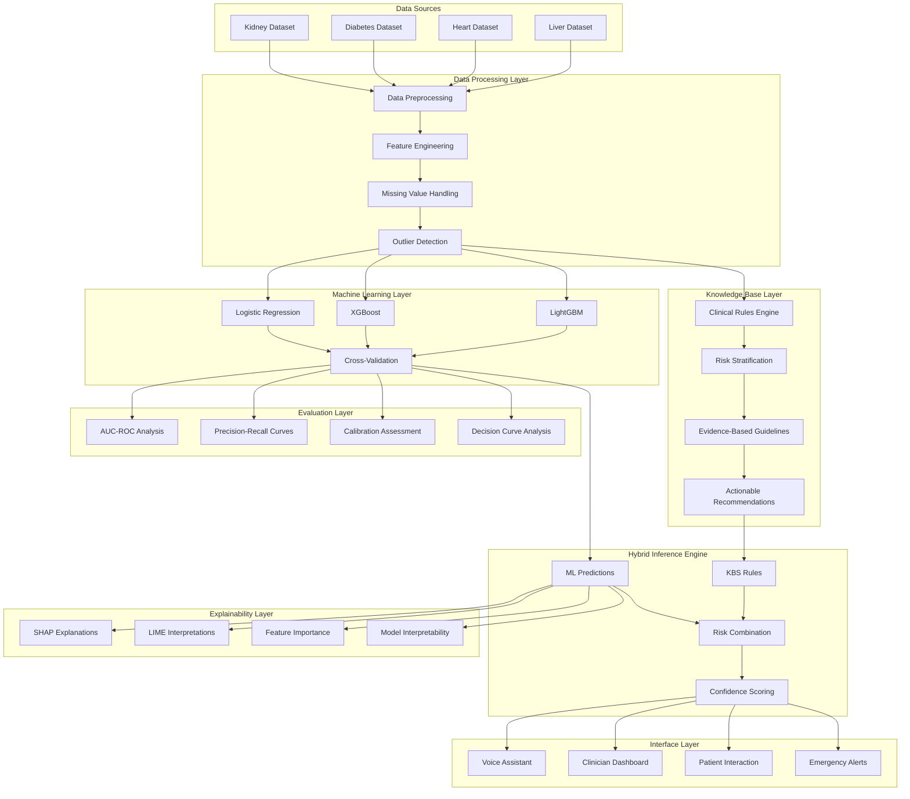
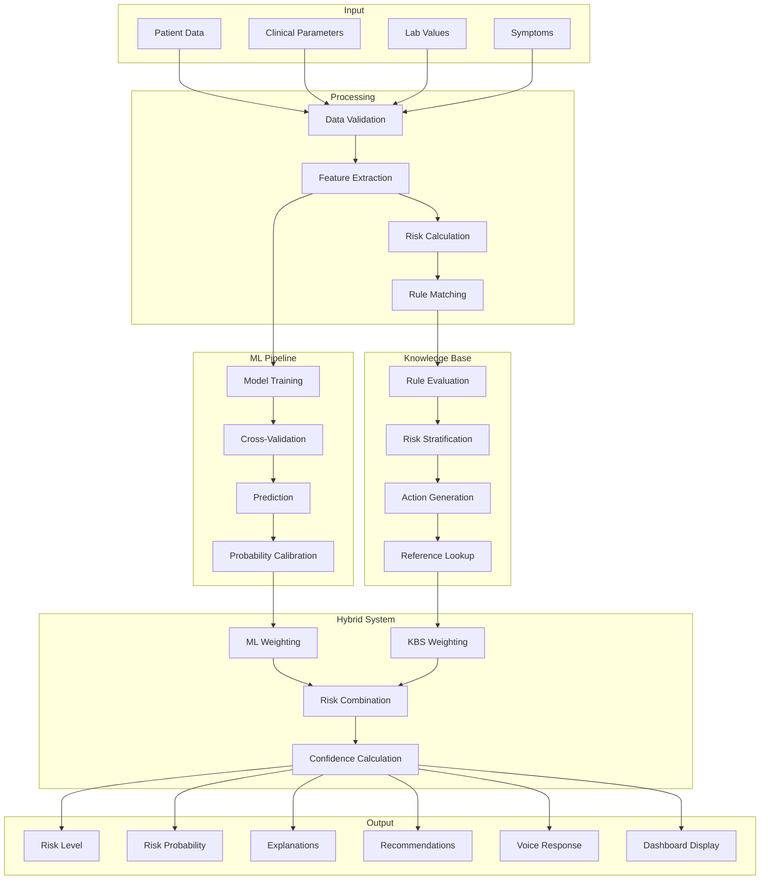
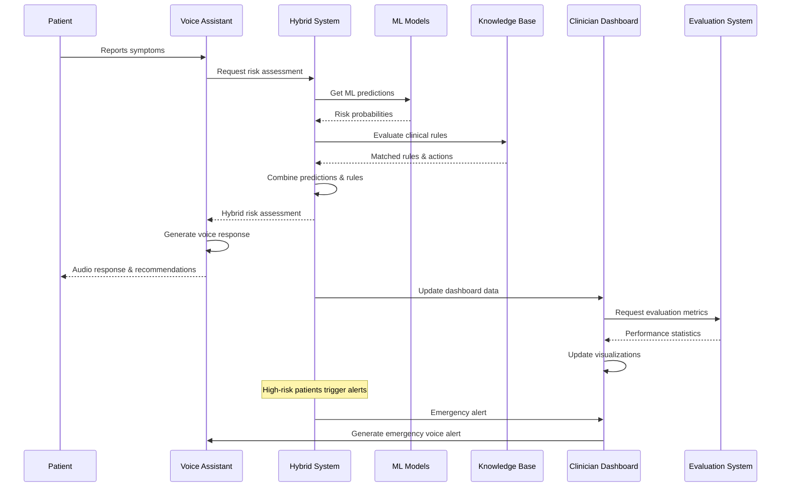
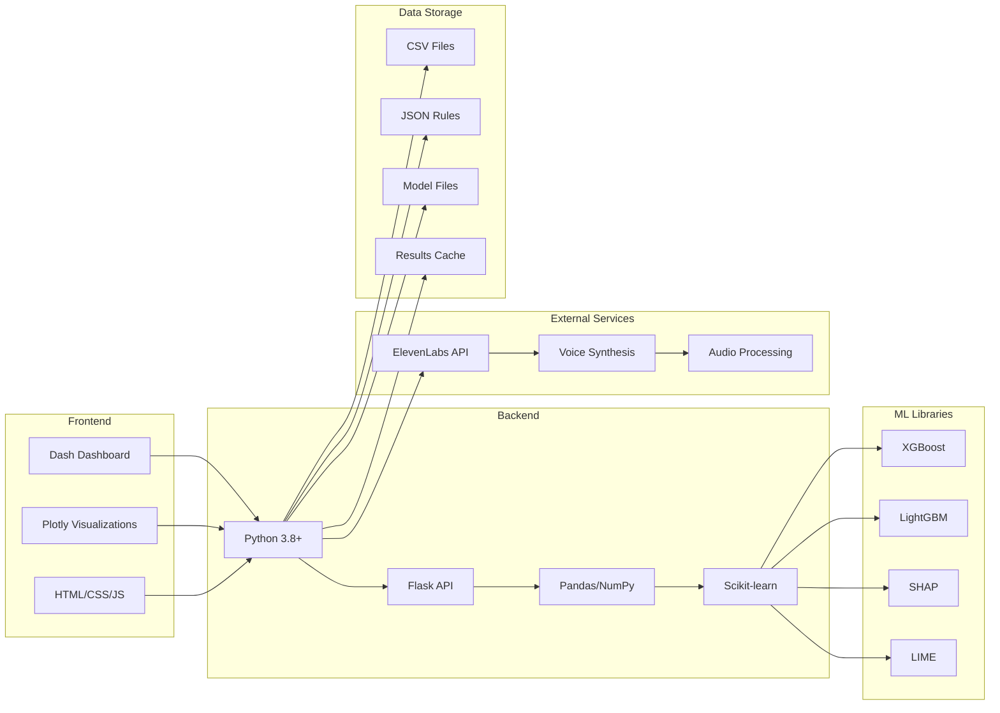
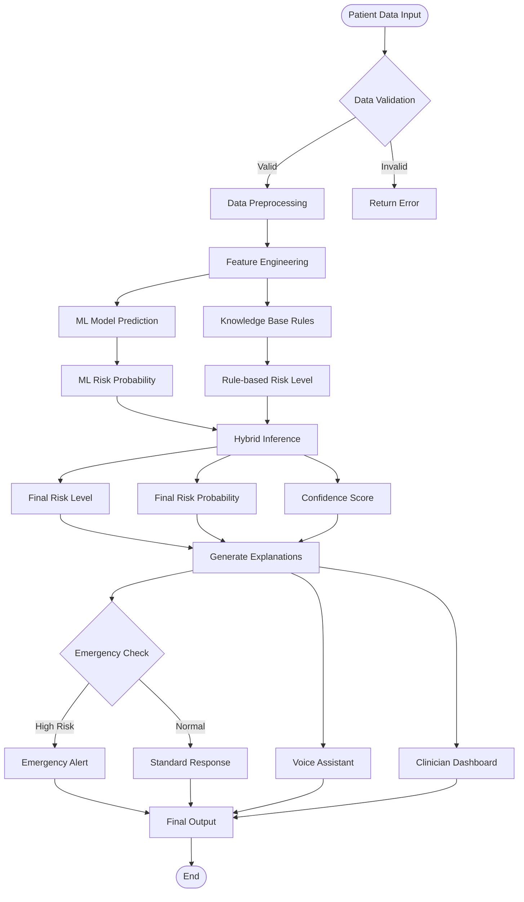
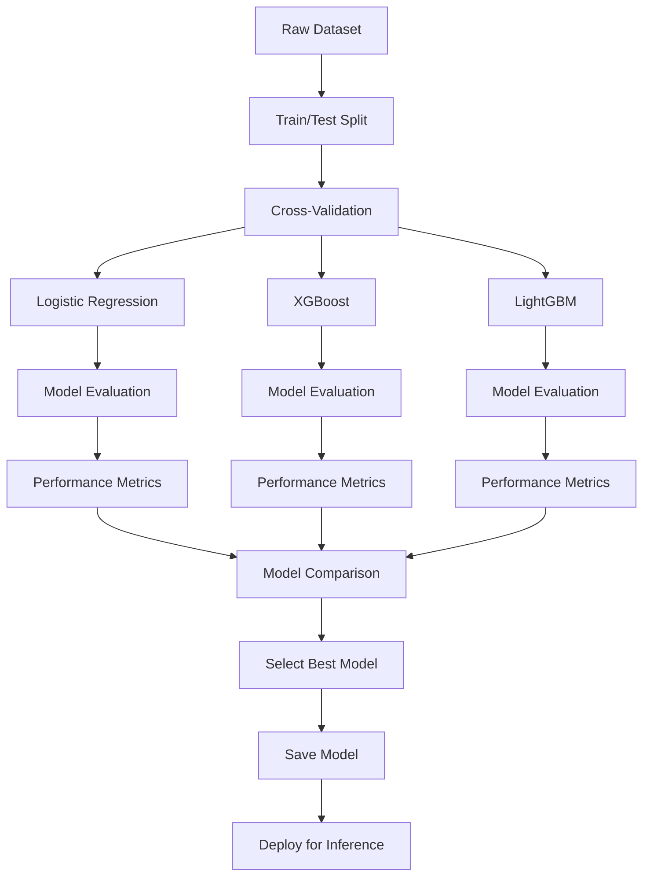

# AI-Powered Proactive Patient Risk Advisor - System Architecture

## High-Level Architecture

## Data Flow Diagram

## Component Interaction Diagram

## Technology Stack

## Risk Assessment Workflow

## Model Training Pipeline

This architecture provides a comprehensive, scalable, and maintainable system for AI-powered healthcare risk assessment with multiple layers of validation, explanation, and user interaction.
